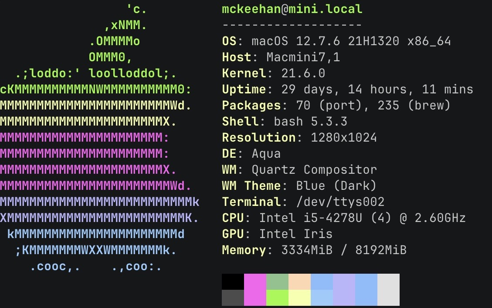

# My Gridsome Failure

I started this project as a basic [gridsome](https://gridsome.org/) project using `gridsome create new-project`.

From there, I was attempting to recreate my https://ki4hdu.com web site that for a while has been generated using [gatsby](https://www.gatsbyjs.com/). The project for the gatsby version is also [publicicly available](https://github.com/mckeehan/ki4hdu-web).

The content for the site is a combination of formats:
1. Blog posts and Notes are in markdown files,
2. Author details (name and avatar) are managed in yaml files,
3. Photos and Photo Galleries are driven by a custom mysql database, and
4. Mapping data in the form of GPX files.

I started from scratch only adding the bare minimum to support what the site needed. I am not a front-end engineer, so I use the [bootstrap](https://getbootstrap.com/) framework to make styling the site relatively easy. Gridsome has some plugins to manage the content transformations: @gridsome/source-filesystem, @gridsome/transformer-remark, @gridsome/transformer-yaml, and gridsome-source-mysql. The only other plugin that I used was to make my `code` blocks better looking: gridsome-plugin-remark-prismjs-all.

I was successful in transforming the blog and note markdown files generating pages for each.
I was also successful in creating a paginated index for the blog entries and a tag-driven index for both the notes and the blog posts.
Photo galleries were also coming along nicely until I added the individul photo pages. It was at this point that my build began having issues. The [build.log](build.log) file shows the output from a build process with it ultimately failing with the error:
```
FATAL ERROR: Reached heap limit Allocation failed - JavaScript heap out of memory
```
I had not even began adding tags indexing of my photos which would dramatically increase the number of pages.

This site generation was done on an older mac mini, so it is entirely possible that I just need a better machine, but the gatsby site continues to generate on this hardware, so...


I also had not started looking the mapping aspects (except to learn that there is no good way to use leaflet in gridsome).
